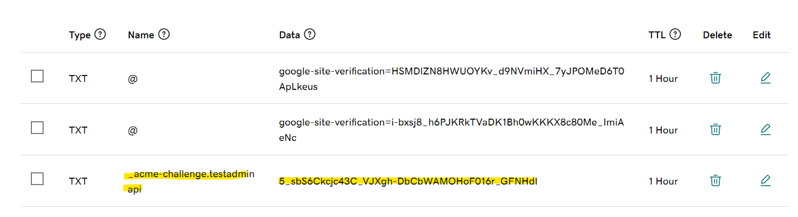

## Install Certbot

Update your system
```
sudo apt update
sudo apt upgrade -y
```

Install Nginx, Certbot, and the Certbot Nginx plugin
```
sudo apt install -y nginx certbot python3-certbot-nginx curl ufw
```

Allow Nginx through your firewall (if you’re using UFW)
```
sudo ufw allow 'Nginx Full'
```

## Request an SSL certificate

### Option 1
```
sudo certbot --nginx -d yourdomain.com -d www.yourdomain.com
```

### Option 2 using TXT
```
sudo certbot certonly --manual --preferred-challenges dns
```
**Terminal Logs**

Saving debug log to /var/log/letsencrypt/letsencrypt.log

Enter email address (used for urgent renewal and security notices)

 > (Enter 'c' to cancel): a@a.com
- - - - - - - - - - - - - - - - - - - - - - - - - - - - - - - - - - - - - - - -
Please read the Terms of Service at
https://letsencrypt.org/documents/LE-SA-v1.4-April-3-2024.pdf. You must agree in
order to register with the ACME server. Do you agree?
- - - - - - - - - - - - - - - - - - - - - - - - - - - - - - - - - - - - - - - -
(Y)es/(N)o:

> (Y)es/(N)o: Y
- - - - - - - - - - - - - - - - - - - - - - - - - - - - - - - - - - - - - - - -
Would you be willing, once your first certificate is successfully issued, to
share your email address with the Electronic Frontier Foundation, a founding
partner of the Let's Encrypt project and the non-profit organization that
develops Certbot? We'd like to send you email about our work encrypting the web,
EFF news, campaigns, and ways to support digital freedom.
- - - - - - - - - - - - - - - - - - - - - - - - - - - - - - - - - - - - - - - -
> (Y)es/(N)o: Y

Account registered.
Please enter the domain name(s) you would like on your certificate (comma and/or
space separated) (Enter 'c' to cancel):

> testadminapi.domain.com

Requesting a certificate for testadminapi.domain.com
- - - - - - - - - - - - - - - - - - - - - - - - - - - - - - - - - - - - - - - -
Please deploy a DNS TXT record under the name:

`_acme-challenge.testadminapi.domain.com.`

with the following value:

`g-QANkK3XQKl31ZAddva9U5p6DmnaaixbHocKeJtosw`

Before continuing, verify the TXT record has been deployed. Depending on the DNS
provider, this may take some time, from a few seconds to multiple minutes. You can
check if it has finished deploying with aid of online tools, such as the Google
Admin Toolbox: https://toolbox.googleapps.com/apps/dig/#TXT/_acme-challenge.testadminapi.domain.com.

Look for one or more bolded line(s) below the line ';ANSWER'. It should show the
value(s) you've just added.
- - - - - - - - - - - - - - - - - - - - - - - - - - - - - - - - - - - - - - - -

> Please press <Enter> after you've created and verified the record



## Renew SSL Certificate

### Option 1 (Best)

Below Command will give you option
```
sudo certbot certonly --force-renewal -d myapp.domain.com
```

Below command will renew certificate using nginx
```
sudo certbot certonly --force-renewal -d yourdomain.com --nginx
```

### Option 2 using TXT

Below command will ask you to enter domain name
```
sudo certbot certonly --manual --preferred-challenges dns
```

Or you can pass domain name as parameter
```
sudo certbot certonly --manual --preferred-challenges dns -d myapp.domain.com
```