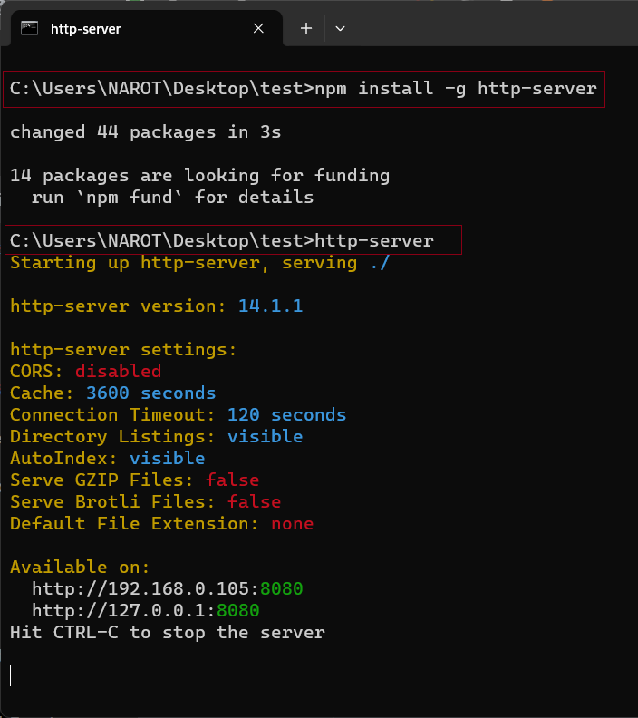
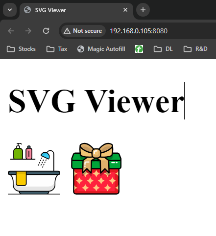

# Run below command

1. Node.js http-server:

   If you have Node.js installed, you can use the http-server package. Install it globally via npm by running this command in your terminal:

```
npm install -g http-server
```

2. Then, navigate to your project directory in the terminal and run:

```
http-server
```

## CMD



## Output


